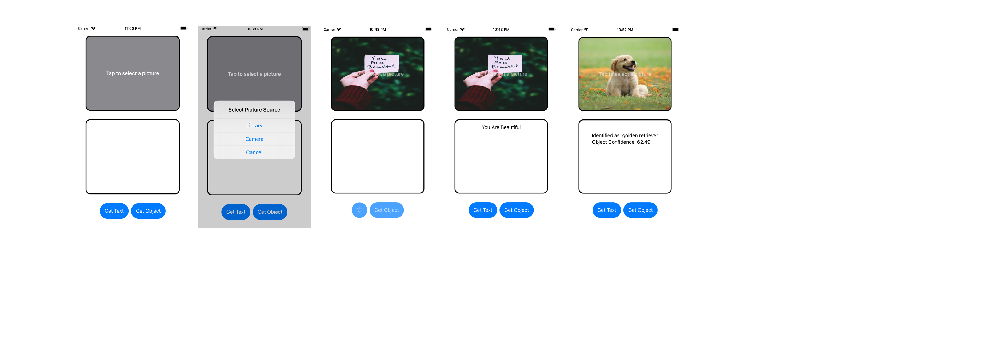

# ImageDetection
A simple iOS app for iPhone that detects objects or texts from an image. 
Allows users to select image from Photo library or take a new picture via camera, and then uses the CoreMl machine learning framework to detection.

Built using SWiftUI

## Tech 

This app was built to try out some of the following :
-   UiKit, 
-   AVFoundation 
-   Vision 
-   PhotosUI 
-   CoreML 
    
